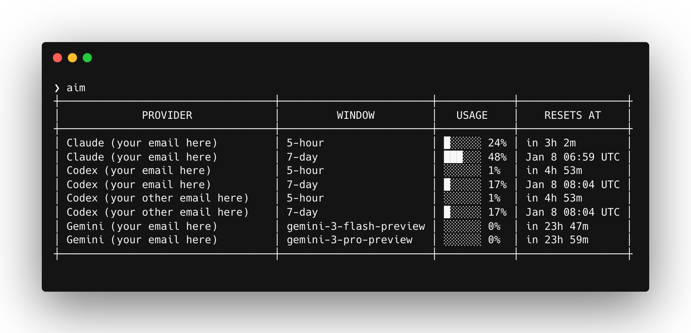

# aim - AI Usage Meter



A CLI tool that displays usage quotas for multiple AI providers in a unified ASCII table.
This tool is intended for use with [CLI Proxy API](https://github.com/router-for-me/CLIProxyAPI).

## Features

- **Multi-provider support**: Claude (Anthropic), Codex (OpenAI), and Gemini (Google)
- **Multiple accounts**: Automatically discovers all Codex and Gemini accounts
- **Unified view**: See all quotas in one table with usage bars and reset times
- **Graceful degradation**: Missing credentials or API failures show warnings without blocking other providers

## Installation

```bash
go install github.com/charlieyou/aim@latest
```

Or build from source (static binary with no runtime dependencies):

```bash
CGO_ENABLED=0 go build -ldflags="-s -w" -o aim .
```

## Usage

```bash
aim
```

Show debug metadata (account id, plan, token fingerprint) for troubleshooting:

```bash
aim --debug
```

Show Gemini 2.x models (labels starting with `gemini-2`):

```bash
aim --gemini-old
```

## Credential Locations

| Provider | Path |
|----------|------|
| Claude   | `~/.cli-proxy-api/claude-{email}.json` |
| Codex    | `~/.cli-proxy-api/codex-{email}.json` |
| Gemini   | `~/.cli-proxy-api/{email}-{project_id}.json` |

The tool reads credentials from these locations automatically. It only updates credential files when a token refresh succeeds.

## Time Display

- **< 24 hours**: Relative format (e.g., `in 2h 15m`)
- **≥ 24 hours**: Absolute timestamp in local time (e.g., `Jan 8 07:00 PST`)

## API Documentation

See [QUOTA_APIS.md](QUOTA_APIS.md) for detailed API reference for each provider.

## License

MIT
